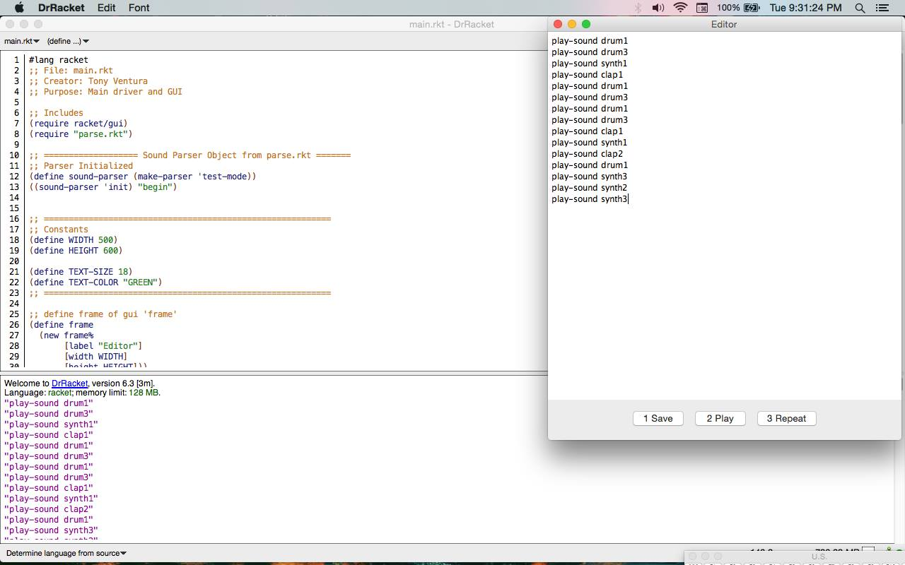

# FP7-webpage The Sound Edtior

##Authors
John Kilgo (Group Lead, Parser)

Tyler Bezuka (Sounds)

Tony Ventura (GUI)

##Overview
The sound editor is a text editor where a user can type several phrases, click a button, and have sounds come out of their computer. The syntax is extremely basic at this point. Please see details below.

##Screenshot


##Concepts Demonstrated
* **Data abstraction** is used to provide access to the elements of the RSS feed.
* The objects in the OpenGL world are represented with **recursive data structures.**
* **Symbolic language processing techniques** are used in the parser.

##External Technology and Libraries
* rsound: [tyler write what you used here and link to it]
* racket/gui [tony write what you used here and link to it]

##Favorite Scheme Expressions
####John (team lead)
My favorite section is the dispatch table in [parser.rkt](https://github.com/oplS16projects/Sound-Editor-JohnTylerTony/blob/v.2.1/parse.rkt). 
```scheme
  (define (dispatch request)
    (cond ;; Call init
          ((eq? request 'init) init)
          ;; Update raw text string
          ((eq? request 'update) update-raw-input)
          ;; Print raw input
          ((eq? request 'print) raw-input)
          ;; Lock the object and parse
          ((eq? request 'done) (if (eq? #f done)(begin (set! done #t) (parse))
                                   (error "Already parsed")))
          ;; Repeat playing
          ((eq? request 'play) (if (eq? #t done)(repeat)(error "No parse")))
          ;; Return the current mode of the object
          ((eq? request 'mode) mode)
          ;; Dump debug info
          ((eq? request 'dump) raw-input)
          ((eq? request 'debug) (begin
                                  (display "Parser mode: ")(display mode)(display "\n")
                                  (display ";; Raw input:\n")(display raw-input)
                                  (display "\n;; sounds-play:\n")(display sounds-play)
                                  (display "\nInput complete? ") done))
          (else (error "Unknown request: Parser" request))))
  ;; Launch the dispatch procedure
  dispatch)
```
####Tyler (rsound)
This expression reads in a regular expression and elegantly matches it against a pre-existing hashmap....
```scheme
(let* ((expr (convert-to-regexp (read-line my-in-port)))
             (matches (flatten
                       (hash-map *words*
                                 (lambda (key value)
                                   (if (regexp-match expr key) key '()))))))
  matches)
```

####Tony (racket/gui)
This expression reads in a regular expression and elegantly matches it against a pre-existing hashmap....
```scheme
(let* ((expr (convert-to-regexp (read-line my-in-port)))
             (matches (flatten
                       (hash-map *words*
                                 (lambda (key value)
                                   (if (regexp-match expr key) key '()))))))
  matches)
```

#How to Download and Run
Please download the  most recent release below.

1. Install rsound library on your computer via Dr. Racket package manager
2. Extract the archive (from release page) and open main.rkt
3. Run the file.
4. Type from the following example into the editor.
5. Click "1 Save", Click "2 Play" (note: once you click play the editor is locked, changes to the editor will not modify the sound), Click "3 Repeat" to repeat your sounds.

###Examples (can combine any number of times and in any order)
```
play-sound drum1
play-sound drum2
play-sound drum3
play-sound drum4
play-sound synth1
play-sound synth2
play-sound synth3
play-sound synth4
play-sound clap1
play-sound clap2
play-sound clap3
play-sound clap4
play-sound claves
```

[Initial Working Release](https://github.com/oplS16projects/Sound-Editor-JohnTylerTony/releases/tag/v.2.1)

